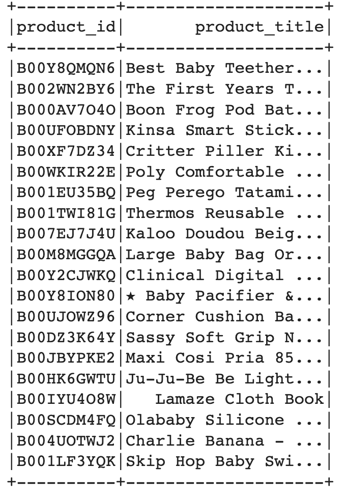
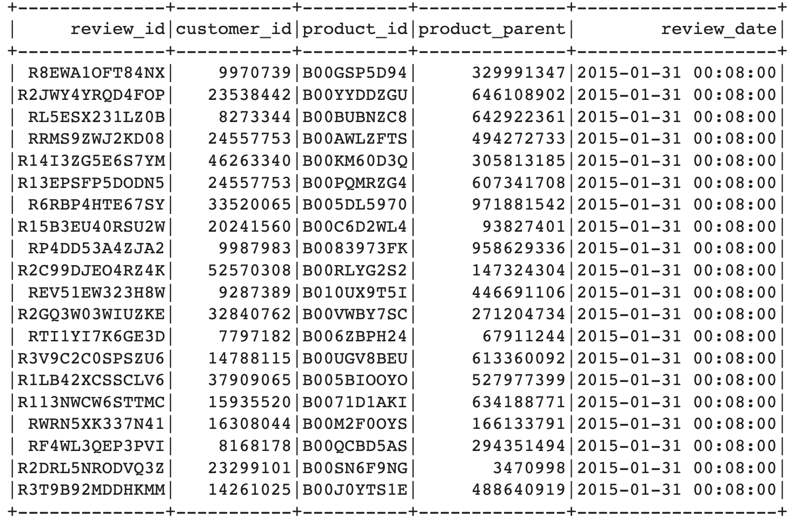
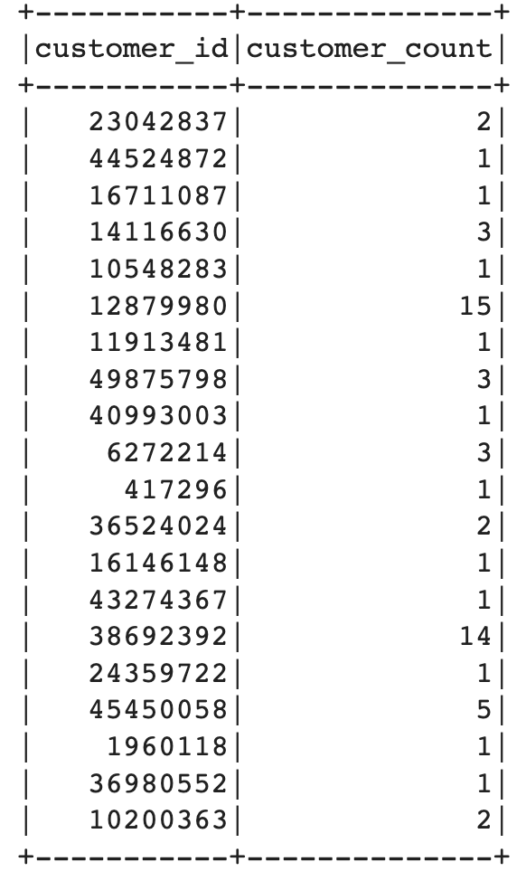

# Big Data - Cloud ETL Process

* In 2 Google Colab notebooks, 2 datasets (baby product and toy product reviews) were extracted from [review dataset](https://s3.amazonaws.com/amazon-reviews-pds/tsv/index.txt), one into each notebook. 

* In each notebook the datasets were transformed to fit the tables in the [schema file](../Resources/schema.sql).

* Then DataFrames that correspond to the tables were loaded into an RDS database.

* Below are spark dataframes that were loaded into the RDS database for the baby product category data.

