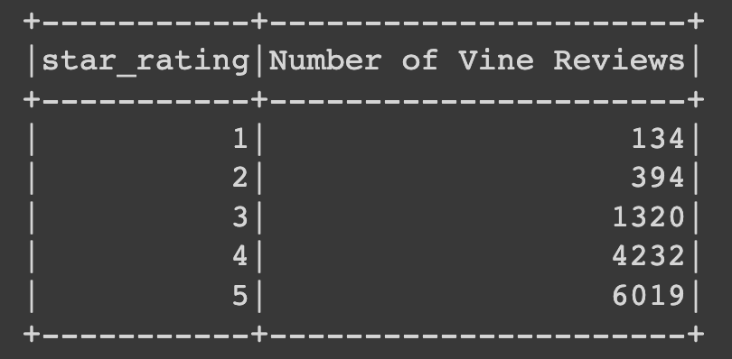

# Big Data - Cloud ETL Process - Amazon Vine

* In 2 different Google Colab notebooks, 2 datasets of Amazon product reviews (one for baby products and one for toy product) were extracted from an Amazon s3 Buckets at this link: [review dataset](https://s3.amazonaws.com/amazon-reviews-pds/tsv/index.txt) 

* In each notebook the datasets were transformed to fit the tables in the [schema file](../Resources/schema.sql).

* Then DataFrames that correspond to the tables were loaded into an RDS database.

* For the baby product data set, the reviews were analyzed to see if vine reviews are bias for higher ratings. From the tables below that count the number of vine and non-vine reviews, for each star rating (1-5), the vine reviews appear to be skewed as higher rated.

* Additionally, the average star rating for all the reviews was about 4 stars, and  84.73% of vine reviews scored at or above average.  And, only about 77.4% of non-vine reviews scored at or above the 4-star average. So it seemes that Vine reviews may be bias to favor the product being reviewed, compared to non-Vine reviews.
